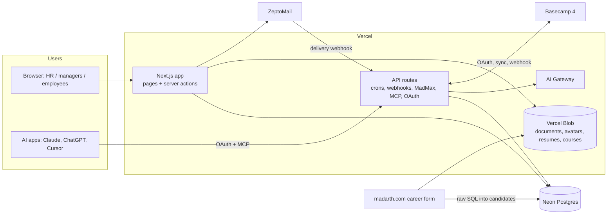

# HCM Design

Part 1 is how the system is put together; part 2 is how the interface looks and behaves. Module details are in [WIKI-DETAILED.md](WIKI-DETAILED.md).

---

# Part 1 — Architecture

## Shape

One Next.js 16 App Router app on Vercel, one Neon Postgres database, a handful of outside services. No separate backend: pages are server components that query Prisma directly; mutations are server actions; API routes exist only for crons, webhooks, streaming, files and machine clients (MCP, OAuth).

## Request flow

1. **Sign-in gate** — `src/app/(app)/layout.tsx` calls `currentUser()`; signed out → `/login`. No middleware.
2. **Session check** — `currentUser()` (`src/lib/rbac.ts`) re-reads the user and their `LoginSession` every request, so disabling a user, changing a role or signing out a device applies at once.
3. **Page guard** — every page calls `requirePageRole` / `requireUser` / `requirePageSelfOrRole`; managers get `teamEmployeeWhere`. The sidebar (`src/lib/nav.ts`) mirrors guards but is not the boundary.
4. **Server actions** — `requireRole` → zod → Prisma → `revalidatePath`, returning `FormState` for inline errors.

## Data

- Prisma 7 with the Neon serverless adapter; schema in `prisma/schema.prisma`.
- One database for local, preview and production → migrations are **additive first, destructive later**, applied by hand with `prisma migrate deploy` before the code ships.
- Tables `candidates` / `candidate_status_changes` are shared with the website and keep its snake_case names.
- Settings live in `AppSetting` (JSON per key), not env vars, when HR should change them.

## Security model

| Concern | Approach |
|---|---|
| Authentication | Email + password (bcrypt, throttled) or passkeys; revocable per-device sessions |
| Authorization | Per-page and per-action role checks; manager scoping; device and course access helpers |
| Personal data | AES-256-GCM field encryption with key ids and rotation; HMAC blind indexes for duplicate checks; never logged |
| Files | Private Blob only, served through access-checked routes |
| Crons | `Bearer CRON_SECRET`, fail closed |
| Webhooks | Basecamp: secret token + re-fetch the payload; ZeptoMail: HMAC signature |
| AI tools | Scope re-checked server-side against the signed-in user, never the model's input; writes need user approval (HMAC-signed in MadMax) and are audited (MCP) |
| MCP clients | OAuth 2.1 with PKCE, short-lived access tokens, rotating refresh tokens, per-user revocation |

## Background work

Vercel crons (`vercel.ts`) do all scheduled work: resume scoring (15 min), Basecamp to-do counts (30 min), leave sync, people sync, jobs sync, reminders, cleanup. Long syncs stream NDJSON progress when run by hand (`/api/basecamp/*-sync`). Jobs are idempotent and resumable: scoring and syncs pick up where they stopped.

## Basecamp

HR connects Basecamp once; background jobs act through the most recently connected HR admin. HCM reads check-ins (leave/WFH), people and photos, to-dos (counts, Assign history) and writes only `[test]`-prefixed to-dos and onboarding invites.

## AI

- Everything goes through the Vercel AI Gateway with model strings; model ids are env-configurable.
- Each call records tokens and Gateway cost in `AiUsage`; HR sees spend on `/ai-usage` and sets MadMax caps.
- One shared credit balance: when it runs out, scoring parks work instead of burning retries, and HR can score through Claude over MCP.
- Resume text and leave posts are treated as data: prompts tell the model to ignore instructions inside them.

## MadMax and MCP share one tool set

`buildTools(context)` in `src/lib/madmax/tools.ts` is the single definition of what an AI can do in HCM, filtered by role. MadMax uses it in-app; `src/lib/mcp/server.ts` registers the same tools for outside AI apps. Adding a tool once makes it available in both places, with the same permissions.

---

# Part 2 — UI design system

## Principles

- **Phone first.** Designed for a phone, enhanced at `md` (768px) for desktop.
- **Plain language** for HR staff. Short labels, sentence case, no jargon or internal names.
- **Indian conventions.** Dates DD/MM/YYYY in IST; money in ₹ (USD shown alongside where it's the source).
- **Nothing jumps.** Every route has a skeleton that matches its layout.

## Layout primitives (`src/components/page.tsx`)

| Component | Use |
|---|---|
| `PageShell` | `<main>` with `px-4 py-5 md:px-6 md:py-8`; widths `sm` (max-w-2xl), `md` (4xl), `lg` (6xl, default), `full` |
| `PageHeader` | Title (`text-xl md:text-2xl font-semibold tracking-tight`), description, actions that wrap under the title on phones |
| `DesktopTable` + `MobileList` | The list pair: bordered table from `md` up, cards (`ListCard`) on phones, dashed empty state |
| `ListCard` (`src/components/list-card.tsx`) | One tappable phone row with chevron; extra actions sit below, never nested |

Navigation: sidebar with collapsible groups (desktop), bottom tab bar per role (phones), breadcrumb — all from `src/lib/nav.ts`.

## Components

- **UI kit** `src/components/ui/`: badge, breadcrumb, button, card, checkbox, collapsible, dialog, input, label, select, separator, sheet, sidebar, skeleton, table, textarea, tooltip (shadcn style on `@base-ui/react`).
- **Data tables** `src/components/data-table/`: `FilterSearch`, `FilterMultiSelect`, `FilterDateRange` (URL is the state; the page builds the query), `TablePagination` (25 a page), `CountChips` (status counts, swipe on phones).
- **Segmented** `src/components/segmented.tsx`: pill links for views and filters.
- **Charts** `src/components/charts/`: hand-built SVG `LineChart` and `BarChart`; values pre-formatted on the server; colours from `.viz-root`.
- **Avatars** `src/components/employee-avatar.tsx`: Basecamp photo or initials.
- **Skeletons** `src/components/page-skeletons.tsx`: each route's `loading.tsx` returns one.

## Forms

`ValidatedForm` + `FormField` + `FormMessage` (`src/components/form/`) with server actions returning `FormState`:
- Messages appear under the field (no browser bubbles); the first bad field is focused and scrolled to; editing clears its message.
- Form-level messages: red for errors, emerald for success.
- Labels wrap controls; `aria-invalid` / `aria-describedby` are set automatically.

## Tokens and colour

Defined in `src/app/globals.css` (Tailwind 4 `@theme inline`, oklch neutrals, `--radius: 0.625rem`).

| Use | Classes |
|---|---|
| Secondary text | `text-zinc-500` |
| Borders | `border-zinc-200 dark:border-zinc-800` |
| Error / overdue | `text-red-600 dark:text-red-400`, `stroke-red-500` |
| Warning / pending / waiting | amber: `border-amber-300 bg-amber-50 text-amber-900`, dark `bg-amber-500/10 text-amber-200` |
| Success | `text-emerald-600 dark:text-emerald-400` |
| Charts | `.viz-root` palette (blue, orange, green, amber, pink, grey for other) with dark steps |

Always pair a colour with its dark-mode variant. Dark mode follows the system (`next-themes`, class strategy) with a toggle.

## Typography and icons

- DM Sans (`--font-sans`, also headings), Geist Mono (`--font-mono`); `tabular-nums` for counts and money.
- Icons: `lucide-react`, plus Google Material Symbols as inline SVG in `src/components/icons.tsx`.

## Mobile rules

- Tap targets ~40px on phones, smaller on desktop: `size-10 md:size-8`, `h-10 md:h-8`, `min-h-10`.
- Inputs stay 16px on phones (no iOS zoom).
- Below 48rem every Dialog and Sheet becomes a bottom sheet with rounded top corners and safe-area padding.
- Wide content (calendars, chip rows) scrolls inside its own box; the page never scrolls sideways.
- Viewport `viewportFit: "cover"`; no tap highlight.

## Status visuals

- Score badges and bands (Strong / Fair / Weak) for resume scores.
- Staff to-do ring: red overdue, amber dated, grey no date; `aria-label` spells out the counts.
- Count chips for pipeline and status totals.
- Banners for system states HR must act on (e.g. "resumes waiting for AI credit"), amber, with the next step in plain words.
